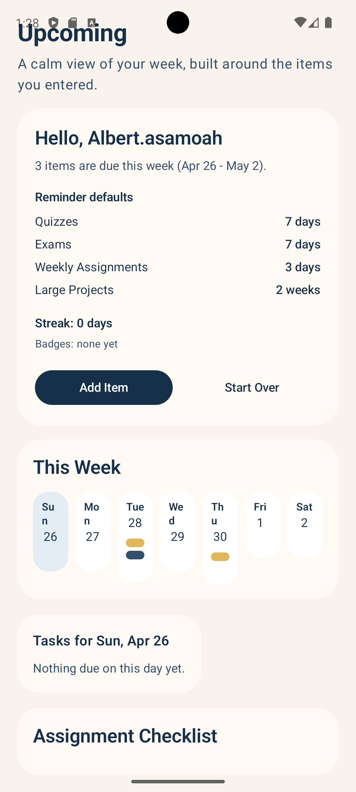

# U-stdy 📚

U-stdy is a modern Android student planner app built with Kotlin and MVVM architecture.  
It helps students organize classes, track assignments, and stay on top of deadlines with real-time updates and smart reminders.

---

## 🚀 Features

- User authentication (Login / Create Account)
- First-time onboarding setup
- Class and task management
- Custom reminders and notifications
- Weekly dashboard view
- Real-time updates using Firestore
- Gamification (streaks and badges)

---
## 📸 Screenshots

| Login Screen | Onboarding | Dashboard |
|-------------|------------|-----------|
|  |  |  |

---
## 🛠️ Tech Stack

- Kotlin (Android)
- MVVM Architecture
- Firebase Firestore (real-time database)
- StateFlow & Coroutines (reactive UI)
- Material UI Components
- Android Studio

---

## 📱 App Workflow

1. User logs in or creates an account  
2. Completes onboarding (classes + preferences)  
3. Adds assignments, quizzes, and exams  
4. Sets reminders  
5. Tracks tasks via dashboard and weekly view  

---

## 🧪 Testing

- Conducted end-to-end testing (login → onboarding → dashboard)
- Validated user input handling and navigation flow
- Tested task creation, reminders, and multiple class entries
- Verified real-time synchronization with Firestore
- Ensured UI responsiveness across screens
- No crashes or blocking issues observed during testing

---
## 📥 Demo

- APK available for testing (can be shared upon request)
- Demo video included in project submission

---
## 📦 Build & Run

1. Clone the repository  
2. Open in Android Studio  
3. Sync Gradle  
4. Run on emulator or physical device  

---

## 📌 Future Improvements

- Offline-first support with local caching
- Automated syllabus parsing and import
- Smart study recommendations using analytics
- Push notifications with Firebase Cloud Messaging
- Google Play Store deployment (.AAB)

---

## 👤 Author

Albert Asamoah  
Marquette University – Computer and Information Science  

## 👥 Contributors

- Albert Asamoah
- Noah Nieberle
- Ifill Sienna
